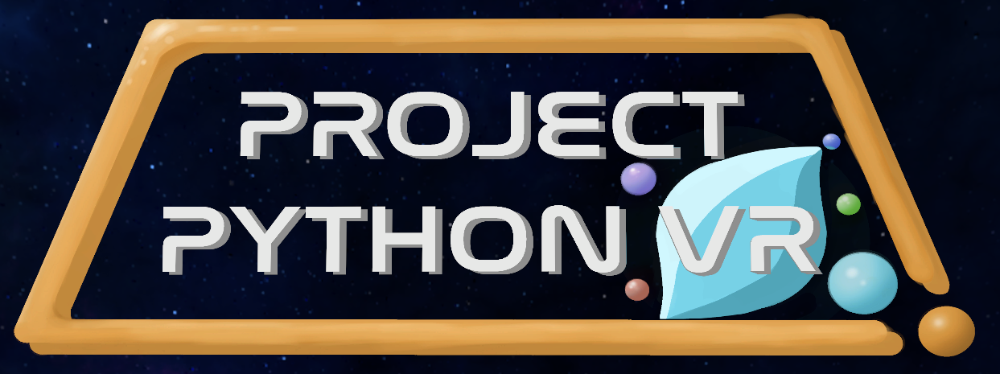

  
  <h1 align="center">ProjectPythonVR</h1>

## About
  Project Python VR is an interactible video game made in Unity, where the player will be able to repair spaceships by solving coding problems. The main feature of Project Python VR is that the players are given empty boxes that are "variables" and data objects that are "ints, floats, Strings, and booleans". The player must pick up the data object and either manipulate it by adding or multiplying other data objects, or place it within the variable box. Once the correct variable is within the box, a spaceship will be repaired and the player will move on to the next level. The main technology is Virtual Reality, done through the Oculus Quest VR Headset. The target for this project is to teach people unfamiliar with coding and VR the basics of variables and variable manipulation and how to use and interact with virtual reality.
  
  
## Project Information

* <b>Difficulty Level:</b> Beginner
* <b>Target Audience:</b> K12 - College
* <b>Duration of Workshop:</b> 30 minutes
* <b>Needed Materials:</b> VR Headset or Computer
* <b>Learning Outcomes:</b> The primary goal of this project is to teach participants the fundamentals of variables and how they are displayed.
* <b>Main Technology:</b> VR, virtual reality, is the main technology used in this project where the student is able to be immersed in a world where they are able to virtually interact with with coding problems and solve them in a fun way.

TAP, the Technology Ambassadors Program, aims to increase the number of students who persist in an IT major or minor, particularly those underrepresented in computing by using interesting and new technologies. [TAP]([https://www.ggc.edu/academics/schools/school-of-science-and-technology/research-internships-service-learning/technology-ambassador-program/](https://www.ggc.edu/academics/school-of-science-and-technology/research-internships-service-learning/technology-ambassador-program)) to access the TAP website at GGC for more information.
  

 

## Team
- Connor Murdock

- Alan Oliver

- David Torres

- Tylor Rowe

## Advisors
* Dr. Cengiz Gunay
* Dr. Rahaf Barakat

## Project Description
A more thorough description of your project. Not a full walkthrough, but describe the different sections of your project and the gist of what participants will be doing when interacting with it and what they'll learn. The student has the option to either play in the VR version or use the [desktop version](https://simmer.io/@ConnorMurdock/project-python-3d) to play via computer/laptop.

## Publications
1. Dr. Cengiz Gunay, Dr. Rahaf Barakat. "Immersive gamification for education: No additional benefit gained from wearing a VR headset", SIGITE ‘23, October 11 - 14,  2023, Marietta, GA, USA.
2. Connor Murdock, Alan Oliver Santiesteban, David Torres, Tylor Rowe, Rahaf Barakat, Cengiz Gunay. “Using Virtual Reality to Teach the Fundamentals of Primitive Data Types, Variables, and Logic Statements in Python”. Poster presented at the 2022 CMD-IT/ACM Richard Tapia Celebration of Diversity in Computing Conference. Washington, DC. Sep 7-10, 2022. Student received Tapia registration waiver.

## Outreach Activities
**Workshops**
  - Workshop #1: Thursday, April 7th, A-1930, Dr. Rahaf Barakat
  - Workshop #2: Thursday, April 14th, A-1910, Mr. Carlos Soares
  - Workshop #3: Monday, April 18th, A-1930, Mrs. Manal Nasir
  - Workshop #4: Wednesday, April 20th, C-1125, Mrs. Manal Nasir
  - Workshop #5: Wednesday, April 27th, C-1125, Mr. Asad Khan
  
**Other Outreach Events**
  - Title 1 Schools, Saturday, April 23rd
  - Super Saturday Series, Saturday, April 30th
  - Women in Technology JAVA Bootcamp, Friday, May 13th

## Similar Projects
If you're interested in more projects that use V

## Technology
  The technology we are using is Virtual Reality. Virtual Reality is a computer generated 3D environment that people can interact with in real life space using special equipment, usually a headset and two controllers, one for each hand. Unity is a game development engine that anyone can use for free, and creators can develop for many platforms uncluding VR.

- [Oculus's Website](https://www.meta.com/quest/)

- [Unity's Website](https://unity.com/)

## Project Setup/Installation
VR Setup
  1. Change the Oculus Headset into Developer Mode
  2. Install Oculus Developer Hub and connect the Oculus Headset to your computer
  3. Upload the .apk file into the headset
  4. Load the game through the Oculus Library on the headset, under the "Unknown Sources" tab

**Web Version**

  - Go to the website [here](https://simmer.io/@ConnorMurdock/project-python-3d) to play the online version.

## Usage
**VR Controls**

  - Point the controllers in the direction that you want to aim
  - Use the trigger button, located under the index finger, to interact with buttons
  - Hold the grip button, located on the side of the controller, to grab and hold objects. Release the button to drop objects.
  
**Web Version Controls**

  - Move the mouse to rotate the camera
  - use left click to interact with objects and buttons

